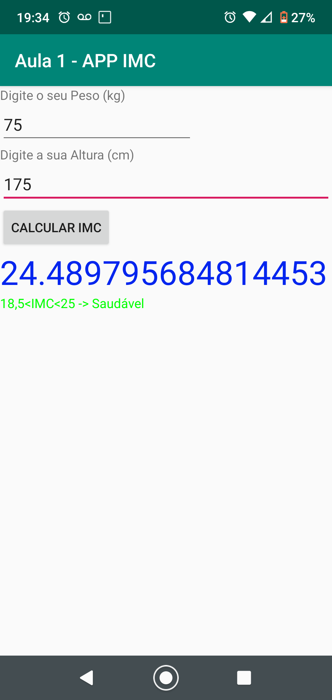
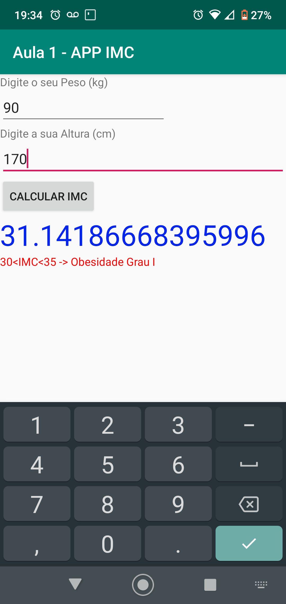
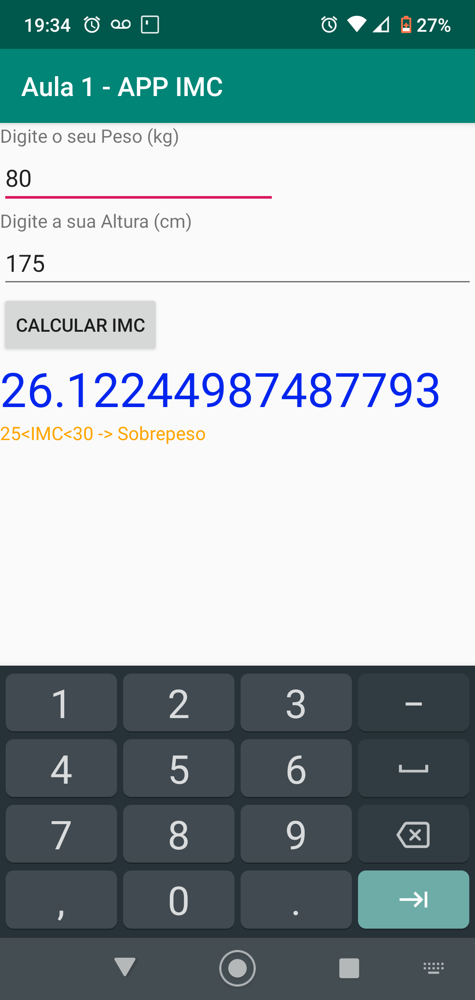
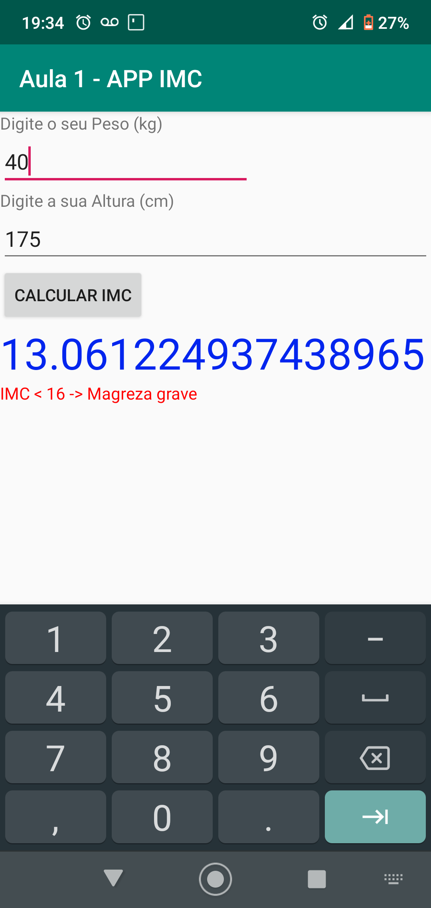
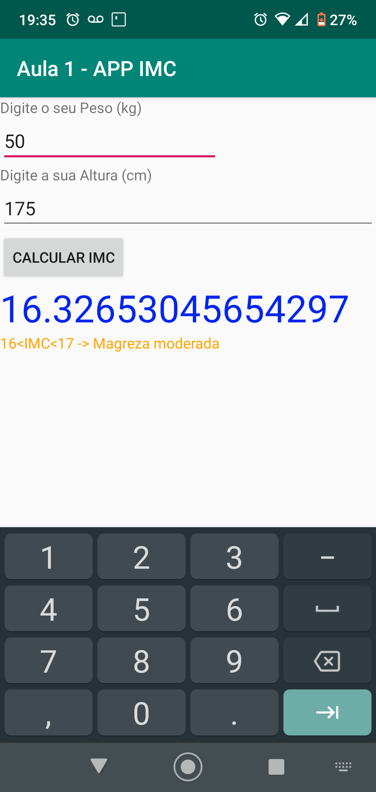

[Versão em Português](./README.md)
# Application for Calculating Body Mass Index - Development Laboratory for Mobile Devices
Application for Calculating Body Mass Index developed on the subject Development Laboratory for Mobile Devices in the Computer Science course at the Pontifical Catholic University of Minas Gerais.

## Pictures

## License
This app is licensed under the license [Mozilla Public License 2.0](https://github.com/Henriquemcc/LDDM-APP_IMC/blob/master/LICENSE).

## System Requirements

To run this app it is necessary to have a smartphone with Android version <b>Kitkat</b> (4.4) or higher.

## How to download and install
To install this app:

1- Download from ["Release"](https://github.com/Henriquemcc/LDDM-APP_IMC/releases) the file [app-debug.apk](https://github.com/Henriquemcc/LDDM-APP_IMC/releases/download/2-alpha/app-debug.apk) on your Android smartphone.

2- Enable installation of apps from unknown sources.

3- And open the downloaded app-debug.apk file and install the app.