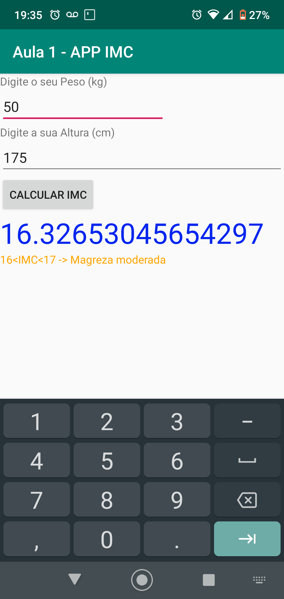

[English Version](./README.EN.md)
# Aplicativo para Cálculo de Índice de Massa Corporal - Laboratório de Desenvolvimento para Dispositivos Móveis 
Aplicativo para Cálculo de Índice de Massa Corporal desenvolvido na matéria Laboratório de Desenvolvimento para Dispositivos Móveis do curso de Ciência da Computação da Pontifícia Universidade Católica de Minas Gerais.

## Imagens

## Licença
Este app está licenciado sobre a licença [Mozilla Public License 2.0](https://github.com/Henriquemcc/LDDM-APP_IMC/blob/master/LICENSE).

## Requisitos de Sistema

Para rodar este app é necessário ter um smartphone com Android versão <b>Kitkat</b>(4.4) ou superior.

## Como baixar e instalar
Para instalar este app:

1- Baixe de ["Release"](https://github.com/Henriquemcc/LDDM-APP_IMC/releases) o arquivo [app-debug.apk](https://github.com/Henriquemcc/LDDM-APP_IMC/releases/download/1-alpha/app-debug.apk) no seu smartphone Android.

2- Habilite a instalação de apps de fontes desconhecidas.

3- E abra o arquivo app-debug.apk baixado e instale o app.